#Importante:
No se muestra el código por motivos de seguridad, para ver el codigo completo contactar con: **aaron_baila@outlook.com**
 
# Explicación del proyecto:
Es un proyecto CRUD realizado con la pila MEAN (MongoDB, ExpressJS, AngularJS, NodeJS).
 
 
**Proyecto:**
 
Se trata de una aplicación inspirada en el modelo de marketplace de Wallapop, especializada en la compra y venta de productos y servicios relacionados con el sector agrario. La plataforma facilita la conexión directa entre compradores y vendedores, ofreciendo un entorno intuitivo, seguro y eficiente para la comercialización de maquinaria, herramientas, insumos agrícolas, ganado y otros recursos vinculados a la actividad agraria.

# Instalación / Visualización:
Todavia no he realizado el despliegue y por motivo de claves no se puede ejecutar a la perfección en local en sus PCs.
Para ver la aplicación en acción, contactar con: **aaron_baila@outlook.com**

# Visualización:

**Bienvenida:**
 
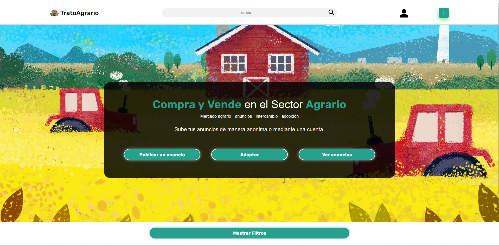 

**Anuncios:**
 
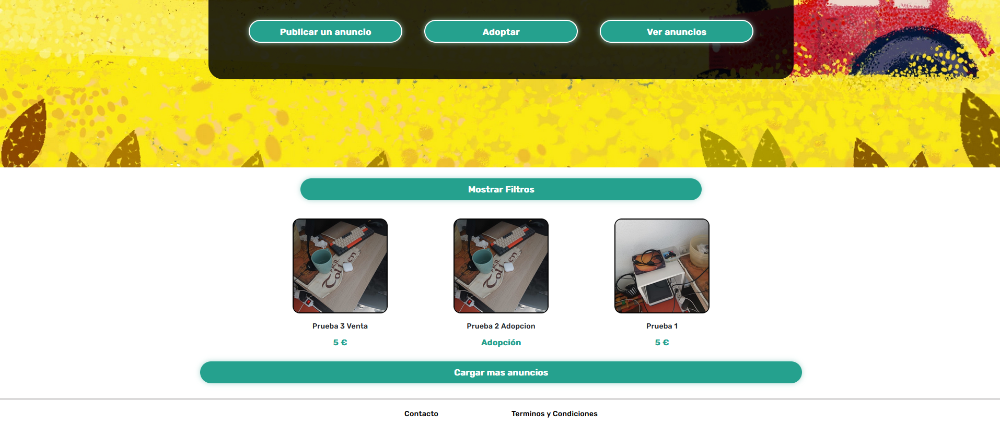 
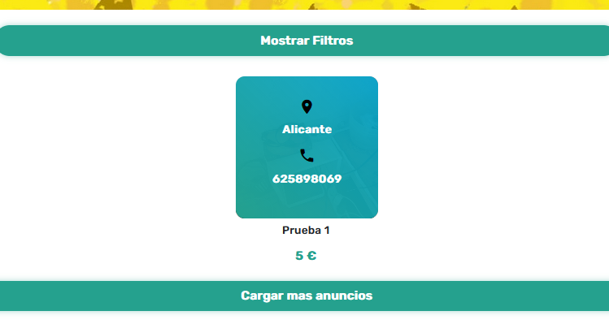 
**Filtros:**
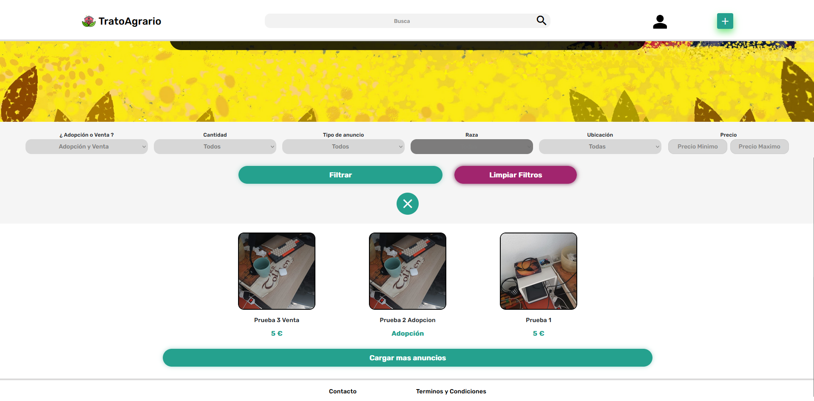 

**Publicar Anuncios:**
 
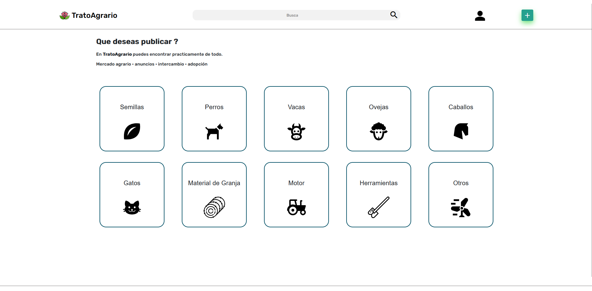 

**Publicar:**
 
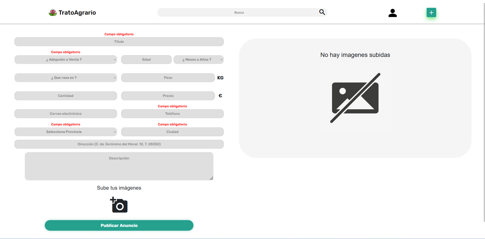 

**Visualizar Anuncio:**
 
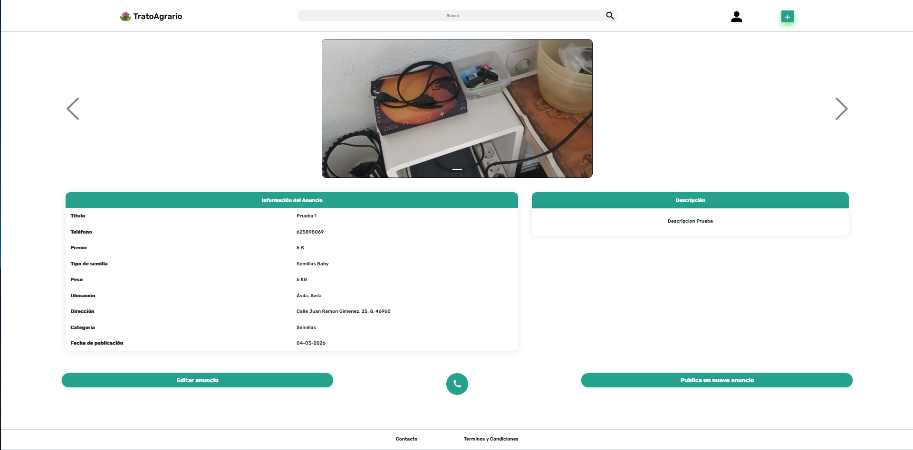 

**Editar Anuncio:**
 
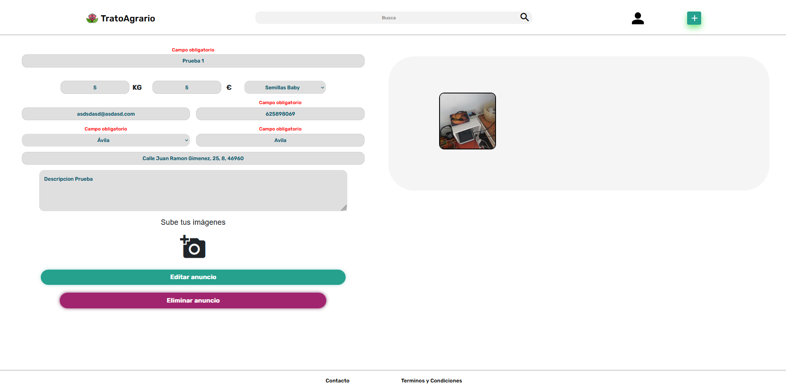 
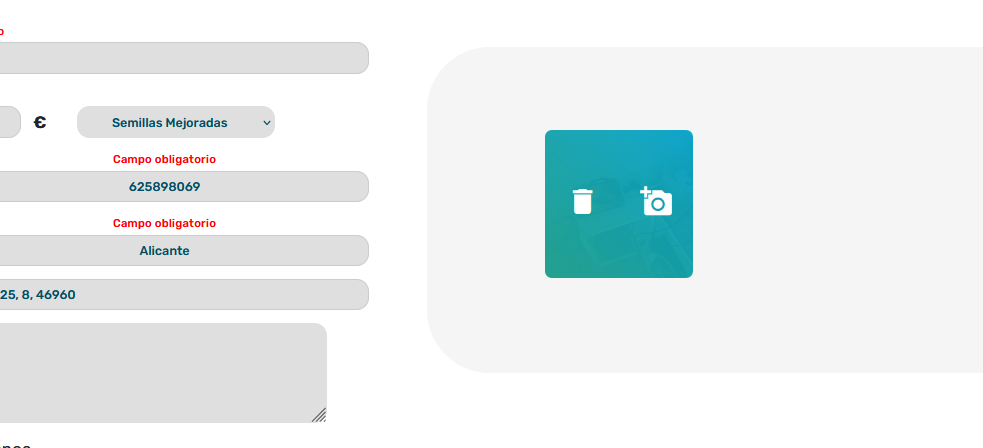 

**Login:**
 
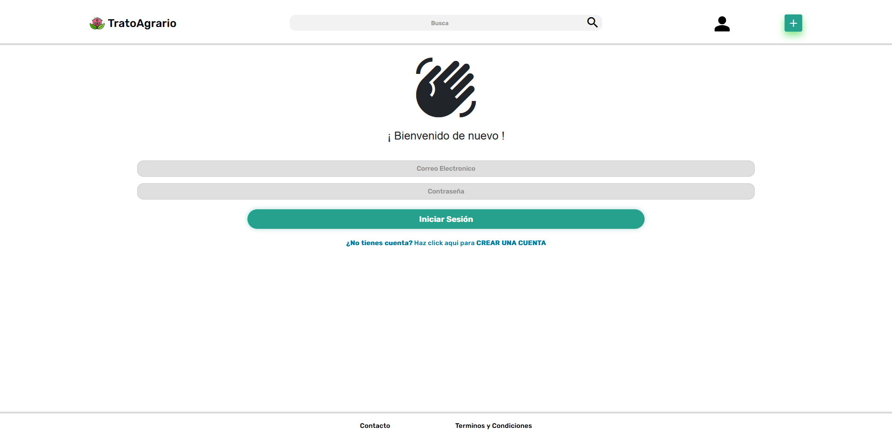 

**Registro:**
 
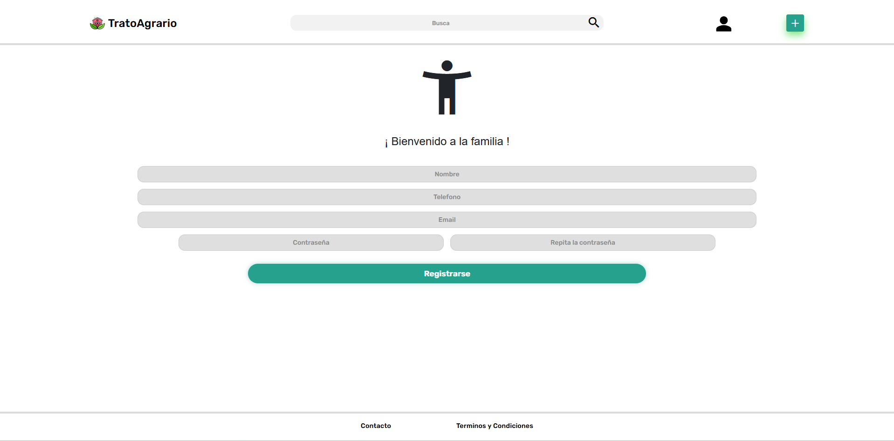 

**Mis anuncios:**
 
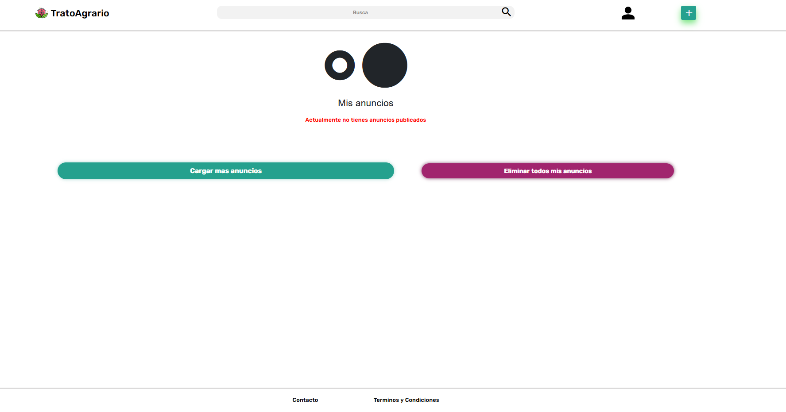 

**Editar perfil:**
 
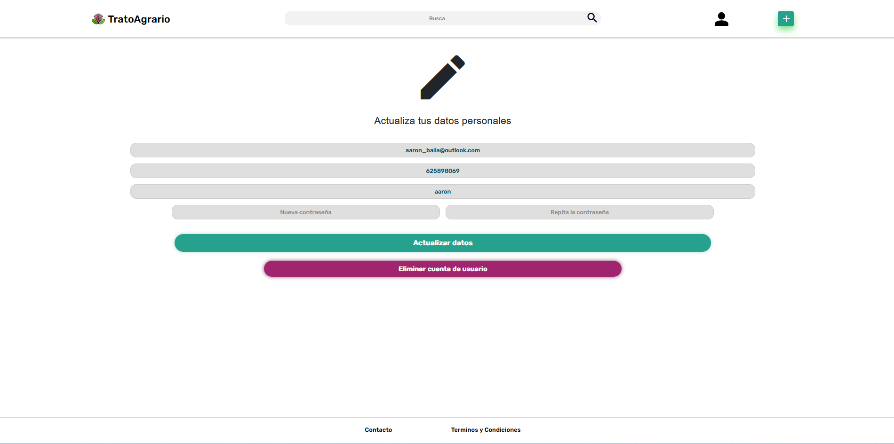 
